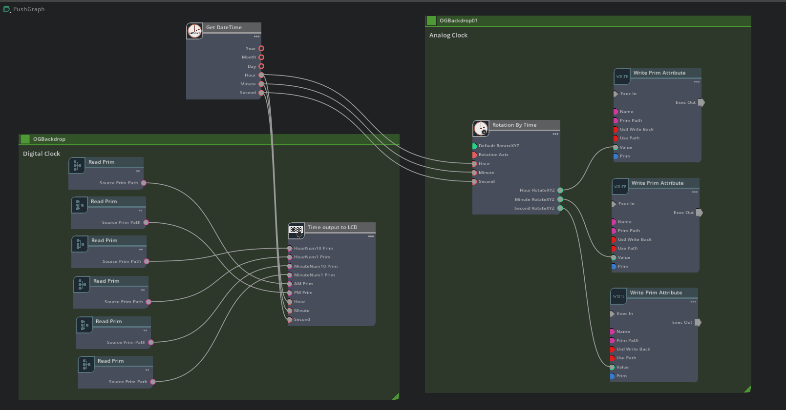
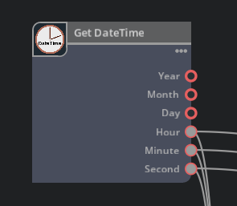
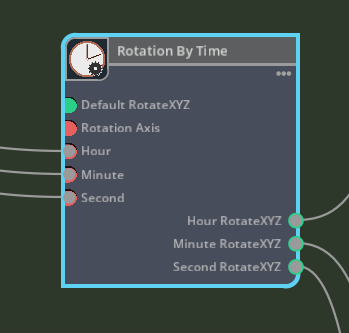

# Description of OmniGraph nodes

This extension consists of three custom nodes.    
     

## Get DateTime

Get the current local date and time.     
     

### Output

* Year (int)
* Month (int)
* Day (int)
* Hour (int)
* Minute (int)
* Second (int)

## Rotation By Time

Given an hour, minute, and second, returns the XYZ of each rotation(degree).     
Used in analog clock rotation.     
     

### Input

* Default RotationXYZ : Default rotation value (float3)
* Rotation Axis : Rotation axis (0:X, 1:Y, 2:Z)
* Hour (int)
* Minute (int)
* Second (int)

### Output

* Hour RotateXYZ : Hour rotation value (float3)
* Minute RotateXYZ : Minute rotation value (float3)
* Second RotateXYZ : Second rotation value (float3)

## Time Output To LCD

This node controls a virtual 7-segment LED LCD screen.      
Show/Hide the Prim specified in Input to display the digital clock.     
     

### Input

* HourNum10 Prim : Specify the 10th digit Prim of hour (token)
* HourNum11 Prim : Specify the 1th digit Prim of hour (token)
* MinuteNum10 Prim : Specify the 10th digit Prim of minute (token)
* MinuteNum11 Prim : Specify the 1th digit Prim of minute (token)
* AM Prim : Specify the prim to display "AM" (token)
* PM Prim : Specify the prim to display "PM" (token)
* Hour (int)
* Minute (int)
* Second (int)
