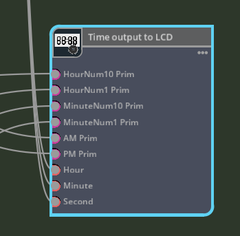

# Description of OmniGraph nodes

This extension consists of three custom nodes.    
     

Three nodes are added to "Examples" as Graph.     
These are nodes that act as Push Graphs.    
     

## Get DateTime

Get the current local date and time.     
     

### Outputs

* Year (int)
* Month (int)
* Day (int)
* Hour (int)
* Minute (int)
* Second (int)

## Rotation By Time

Given an hour, minute, and second, returns the XYZ of each rotation(degree).     
Used in analog clock rotation.     
     

### Inputs

* Default RotationXYZ : Default rotation value (float3)
* Rotation Axis : Rotation axis (0:X, 1:Y, 2:Z)
* Hour (int)
* Minute (int)
* Second (int)

### Outputs

* Hour RotateXYZ : Hour rotation value (float3)
* Minute RotateXYZ : Minute rotation value (float3)
* Second RotateXYZ : Second rotation value (float3)

Connect the Output value of the Get DateTime node to the Hour/Minute/Second of Inputs.      
The analog clock "[clock.usd](./usds/Clock/clock.usd)" referenced in this stage has a default rotation of Rotate(90, 0, 0).
It also rotates the hands of the clock around the Y axis.     
This is the same for Hour/Minute/Second hands.     

     
In Inputs, set "Default RotationXYZ" to (90, 0, 0) and "Rotation Axis" to 1 (Y).     

This input returns the calculated rotation values for "Hour RotateXYZ", "Minute RotateXYZ", and "Second RotateXYZ".     

Clock hand prims are added to Graph as "Write Prim Attribute".    
     
In this case, select "xformOp:rotateXYZ" for the "Attribute Name".     
     
Connect "Hour RotateXYZ", "Minute RotateXYZ", and "Second RotateXYZ" of "Rotation By Time" to the Value of this node.     

This is all that is required to move the hands of an analog clock.     

## Time Output To LCD

This node controls a virtual 7-segment LED LCD screen.      
Show/Hide the Prim specified in Input to display the digital clock.     
     

### Inputs

* HourNum10 Prim : Specify the 10th digit Prim of hour (token)
* HourNum11 Prim : Specify the 1th digit Prim of hour (token)
* MinuteNum10 Prim : Specify the 10th digit Prim of minute (token)
* MinuteNum11 Prim : Specify the 1th digit Prim of minute (token)
* AM Prim : Specify the prim to display "AM" (token)
* PM Prim : Specify the prim to display "PM" (token)
* Hour (int)
* Minute (int)
* Second (int)

The digital clock is controlled by showing/hiding the respective parts of the virtual LCD screen.     
     

”AM" and "PM" are one prim (mesh) each.      
Hours and minutes are on a two-digit, seven-segment LED.     
It consists of A, B, C, D, E, F, and G Prim(Mesh) respectively.      
     

By showing/hiding this 7-segment LED component, a numerical value from 0-9 is represented.      

The Hour, Minute, and Second inputs to the "Time Output To LCD" node are connected from the output of "Get DateTime".     
Each input to the "Time Output To LCD" node uses the "Source Prim Path" of the Read Bundle.      
     
AM, PM and 4 LED's Prim connected.      

This allows the digital clock to reflect the current time.     

