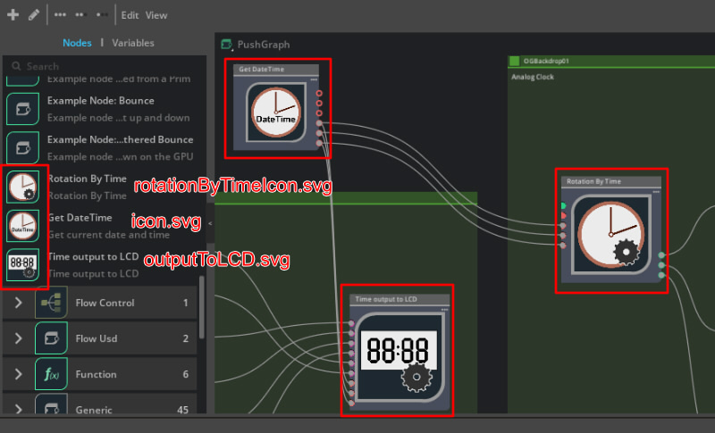

# Extension Structure

The extension has the following structure.      

Extension name is "ft_lab.OmniGraph.GetDateTime".     
```
[ft_lab.OmniGraph.GetDateTime]
  [config]
    extension.toml

  [data]
    [icons]
      icon.svg
      outputToLCD.svg
      rotationByTimeIcon.svg
    icon.png
    preview.jpg

  [docs]
    CHANGELOG.md
    index.rst
    README.md
  [ft_lab]
    [OmniGraph]
      [GetDateTime]
        [nodes]
          GetDateTime.ogn
          GetDateTime.py
          OutputToLCD.ogn
          OutputToLCD.py
          RotationByTime.ogn
          RotationByTime.py

        [ogn]
          __init__.py
          GetDateTimeDatabase.py
          OutputToLCDDatabase.py
          RotationByTimeDatabase.py

        __init__.py
        extension.py
```

The Extension configuration file is "extension.toml".     
This section describes only the information on creating custom nodes for OmniGraph in Extension.     

## Files per node

The data for OmniGraph nodes uses files with the extension ogn.     
If there is an ogn file called "GetDateTime.ogn", the node name is "GetDateTime".     
One node consists of three files.      

```
[nodes]
  GetDateTime.ogn
  GetDateTime.py
[ogn]
  GetDateTimeDatabase.py
```

|File|Description|     
|---|---|     
|GetDateTime.ogn|Node configuration in json format|     
|GetDateTime.py|Describes the implementation part of the node|     
|GetDateTimeDatabase.py|Describe the implementation as a custom node.<br>It is almost always a canned statement.|     

”GetDateTimeDatabase.py" specifies "[node name]Database.py".      

## extension.toml

```
# Watch the .ogn files for hot reloading (only works for Python files)
[fswatcher.patterns]
include = ["*.ogn", "*.py"]
exclude = ["*Database.py","*/ogn*"]

# We only depend on testing framework currently:
[dependencies]
"omni.graph" = {}
"omni.graph.nodes" = {}
"omni.graph.tools" = {}
```

In [fswatcher.patterns], add the information to be used by OmniGraph nodes.      
I think there is no problem copying and pasting the above as is.      

Specify other Extensions to be used with OmniGraph in [dependencies].      
This will be enabled if disabled before this Extension is called.       

## Icons used in graph

In "data/icons", icons used in nodes are stored as SVG files.     

```
[data]
  [icons]
    icon.svg
    outputToLCD.svg
    rotationByTimeIcon.svg
```

These icons are used in the node graph in Omniverse Create at the following locations.    
      

I created the svg file in Affinity Desigier( https://affinity.serif.com/ ).    

## Nodes

The following three nodes exist.      
Please also see "[Description of OmniGraph nodes](../OmniGraphNodes.md)" for node descriptions.      

|Node name|Description|    
|---|---|     
|GetDateTime|Get the current local date and time.|     
|RotationByTime|Given an hour, minute, and second, returns the XYZ of each rotation(degree).|     
|OutputToLCD|This node controls a virtual 7-segment LED LCD screen.|     

