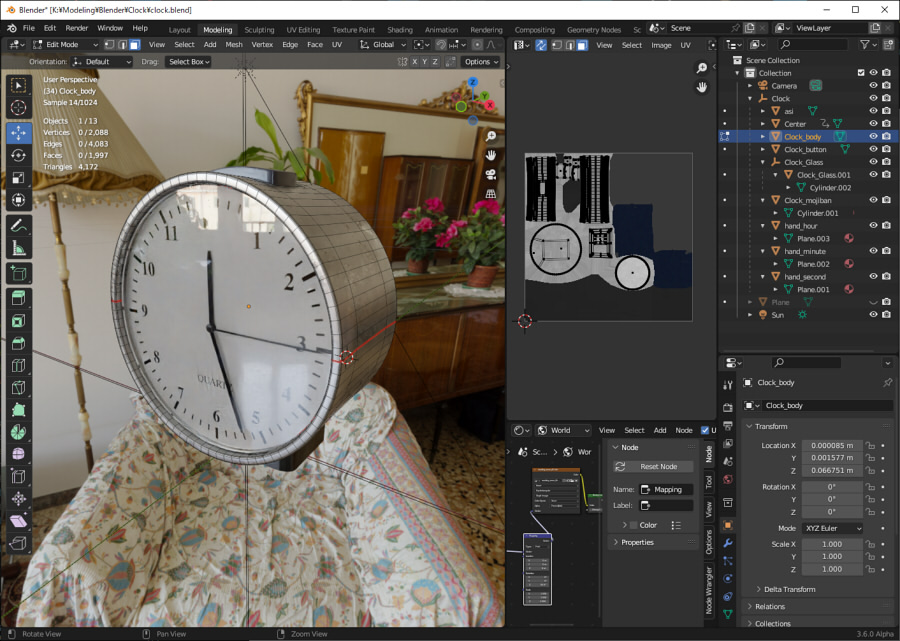
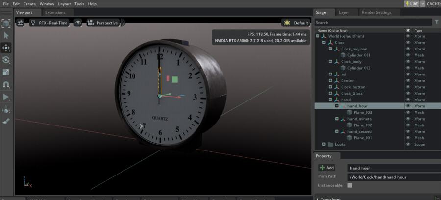
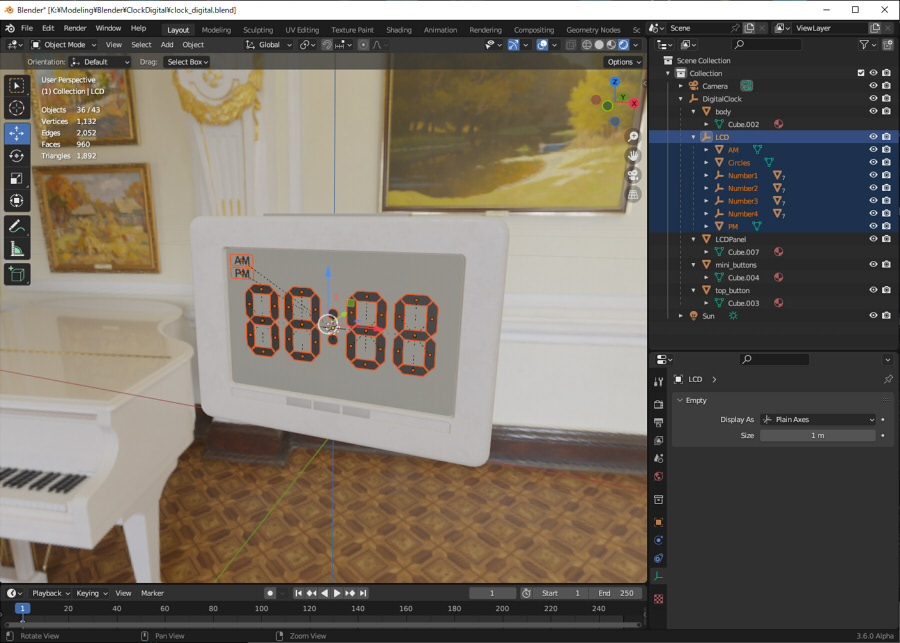
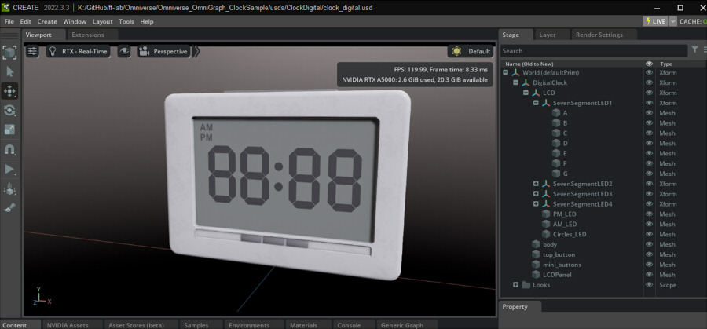

# 3D model

I modeled 3D models of analog and digital clocks in Blender.     
I used the Blender 3.6 alpha USD branch which can be launched from the Omniverse Launcher.     
This is because I want to export the correct USD from Blender.     

Shapes modeled in Blender were exported in fbx format and textured in Substance 3D Painter.     

The USD files imported into Omniverse Create were also edited for stage hierarchy.      

## Clock

     

Analog clocks use hour, minute, and second hands.    
To organize this part of the process, I imported it once into Omniverse Create and organized it.      
     

The final usd file is placed at "[usds/Clock](../usds/Clock)".    
Check which Prim the hour, minute, and second hands are.     

## Digital Clock

     

For digital clocks, note the AM/PM/7-segment LED on the LCD.     
This is used by showing/hiding each of them.    
AM/PM gives the quadrangle mesh a texture with Opacity as the material.     

To organize this, I imported it into Omniverse Create and edited it.     
     

"SevenSegmentLED1", "SevenSegmentLED2", "SevenSegmentLED3", "SevenSegmentLED4", and a mesh of parts A through G as children.     
The Mesh of the letters on this LCD was placed with a slight float in the normal direction.      

The final usd file is placed at "[usds/ClockDigital](../usds/ClockDigital)".    

