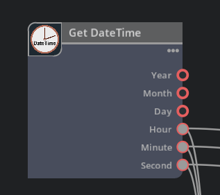

# GetDateTime

Get the current local date and time.     
     

## GetDateTime.json

```json
{
    "GetDateTime": {
        "version": 1,
        "categories": "examples",
        "description": "Get datetime node.",
        "language": "Python",
        "metadata": {
            "uiName": "Get DateTime"
        },
        "inputs": {
        },
        "outputs": {
            "a1_year": {
                "type": "int",
                "description": "year",
                "default": 2000,
                "metadata": {
                    "uiName": "Year"
                }
            },
            "a2_month": {
                "type": "int",
                "description": "month",
                "default": 1,
                "metadata": {
                    "uiName": "Month"
                }
            },
            "a3_day": {
                "type": "int",
                "description": "day",
                "default": 1,
                "metadata": {
                    "uiName": "Day"
                }
            },
            "b1_hour": {
                "type": "int",
                "description": "hour",
                "default": 1,
                "metadata": {
                    "uiName": "Hour"
                }
            },
            "b2_minute": {
                "type": "int",
                "description": "minute",
                "default": 1,
                "metadata": {
                    "uiName": "Minute"
                }
            },
            "b3_second": {
                "type": "int",
                "description": "second",
                "default": 1,
                "metadata": {
                    "uiName": "Second"
                }
            }
        }
    }
}
```
     

No inputs is provided, as it only outputs the current time.     
Outputs date and time in int type.     

### Outputs

|Attribute name|Type|UI name|Description|    
|---|---|---|---|    
|a1_year|int|Year|year|    
|a2_month|int|Month|month|    
|a3_day|int|Day|day|    
|b1_hour|int|Hour|hour|    
|b2_minute|int|Minute|minute|    
|b3_second|int|Second|second|    

The "a1_" or "b1_" at the beginning of the attribute name is used to display the data in ascending order when it is displayed in a graph.     
This is done to prevent the node inputs/outputs from being sorted in ascending order as ASCII code strings when displaying the inputs/outputs of the node in the UI.      
The order is ascending by attribute name, and the display name is the UI name.      

## GetDateTime.py

”GetDateTime.py" specifies what the node actually does.      

```python
import numpy as np
import omni.ext
import datetime

class GetDateTime:
    @staticmethod
    def compute(db) -> bool:
        try:
            # Get current date and time.
            now = datetime.datetime.now()
            db.outputs.a1_year   = now.year
            db.outputs.a2_month  = now.month
            db.outputs.a3_day    = now.day
            db.outputs.b1_hour   = now.hour
            db.outputs.b2_minute = now.minute
            db.outputs.b3_second = now.second

        except TypeError as error:
            db.log_error(f"Processing failed : {error}")
            return False
    
        return True
```

Get the date and time and store them in the outputs.     
Data is set to "db.outputs.[Attribute name]".     

## GetDateTimeDatabase.py

The registration process as an Extension of the OmniGraph node is performed.     
Since this code is almost canned, it is expected that once it is created, it will be reused.      

In the case of "GetDateTimeDatabase.py", enter the class "GetDateTimeDatabase(og.Database)".      

```python
import omni.graph.core as og
import omni.graph.core._omni_graph_core as _og
import omni.graph.tools.ogn as ogn
import numpy
import sys
import traceback
import carb

class GetDateTimeDatabase(og.Database):
    PER_NODE_DATA = {}

    INTERFACE = og.Database._get_interface([
        ('outputs:a1_year', 'int', 0, 'Year', 'output year', {ogn.MetadataKeys.DEFAULT: '2000'}, True, 0, False, ''),
        ('outputs:a2_month', 'int', 0, 'Month', 'output month', {ogn.MetadataKeys.DEFAULT: '1'}, True, 0, False, ''),
        ('outputs:a3_day', 'int', 0, 'Day', 'output day', {ogn.MetadataKeys.DEFAULT: '1'}, True, 0, False, ''),
        ('outputs:b1_hour', 'int', 0, 'Hour', 'output hour', {ogn.MetadataKeys.DEFAULT: '1'}, True, 0, False, ''),
        ('outputs:b2_minute', 'int', 0, 'Minute', 'output minute', {ogn.MetadataKeys.DEFAULT: '0'}, True, 0, False, ''),
        ('outputs:b3_second', 'int', 0, 'Second', 'output second', {ogn.MetadataKeys.DEFAULT: '0'}, True, 0, False, ''),
    ])
```

"INTERFACE" enumerates attribute data.     
The input and output data, in turn, will include the following.      

* Attribute name
* Type (To allow more than one, separate them with a comma)
* Index of type ? Specify 0 for a single Type or 1 for multiple Types.
* Display name in UI
* Description
* Meta data
* Necessary or not (True, False)
* Default value
* Deprecated (True, False)
* Message when deprecated

Attribute name and type must match those specified in the ogn file.     
In the case of the OmniGraph node provided by Extension, it seemed to refer to this description rather than the ogn file.      

### ValuesForOutputs

The outputs designation is described in the "ValuesForOutputs" class.    

```python
    class ValuesForOutputs(og.DynamicAttributeAccess):
        LOCAL_PROPERTY_NAMES = { "a1_year", "a2_month", "a3_day", "b1_hour", "b2_month", "b3_second" }
        """Helper class that creates natural hierarchical access to output attributes"""
        def __init__(self, node: og.Node, attributes, dynamic_attributes: og.DynamicAttributeInterface):
            """Initialize simplified access for the attribute data"""
            context = node.get_graph().get_default_graph_context()
            super().__init__(context, node, attributes, dynamic_attributes)
            self._batchedWriteValues = { }

        @property
        def a1_year(self):
            value = self._batchedWriteValues.get(self._attributes.a1_year)
            if value:
                return value
            else:
                data_view = og.AttributeValueHelper(self._attributes.a1_year)
                return data_view.get()

        @a1_year.setter
        def a1_year(self, value):
            self._batchedWriteValues[self._attributes.a1_year] = value

        @property
        def a2_month(self):
            value = self._batchedWriteValues.get(self._attributes.a2_month)
            if value:
                return value
            else:
                data_view = og.AttributeValueHelper(self._attributes.a2_month)
                return data_view.get()

        @a2_month.setter
        def a2_month(self, value):
            self._batchedWriteValues[self._attributes.a2_month] = value

        @property
        def a3_day(self):
            value = self._batchedWriteValues.get(self._attributes.a3_day)
            if value:
                return value
            else:
                data_view = og.AttributeValueHelper(self._attributes.a3_day)
                return data_view.get()

        @a3_day.setter
        def a3_day(self, value):
            self._batchedWriteValues[self._attributes.a3_day] = value

        @property
        def b1_hour(self):
            value = self._batchedWriteValues.get(self._attributes.b1_hour)
            if value:
                return value
            else:
                data_view = og.AttributeValueHelper(self._attributes.b1_hour)
                return data_view.get()

        @b1_hour.setter
        def b1_hour(self, value):
            self._batchedWriteValues[self._attributes.b1_hour] = value

        @property
        def b2_minute(self):
            value = self._batchedWriteValues.get(self._attributes.b2_minute)
            if value:
                return value
            else:
                data_view = og.AttributeValueHelper(self._attributes.b2_minute)
                return data_view.get()

        @b2_minute.setter
        def b2_minute(self, value):
            self._batchedWriteValues[self._attributes.b2_minute] = value

        @property
        def b3_second(self):
            value = self._batchedWriteValues.get(self._attributes.b3_second)
            if value:
                return value
            else:
                data_view = og.AttributeValueHelper(self._attributes.b3_second)
                return data_view.get()

        @b3_second.setter
        def b3_second(self, value):
            self._batchedWriteValues[self._attributes.b3_second] = value


        def __getattr__(self, item: str):
            if item in self.LOCAL_PROPERTY_NAMES:
                return object.__getattribute__(self, item)
            else:
                return super().__getattr__(item)

        def __setattr__(self, item: str, new_value):
            if item in self.LOCAL_PROPERTY_NAMES:
                object.__setattr__(self, item, new_value)
            else:
                super().__setattr__(item, new_value)

        def _commit(self):
            _og._commit_output_attributes_data(self._batchedWriteValues)
            self._batchedWriteValues = { }
```

Specify the attribute names to be used in order in "LOCAL_PROPERTY_NAMES".       

```python
    LOCAL_PROPERTY_NAMES = { "a1_year", "a2_month", "a3_day", "b1_hour", "b2_month", "b3_second" }
```

Specify getter/setter for each attribute.      
If the attribute type is fixed, simply change the attribute name.     
```python
    @property
    def a1_year(self):
        value = self._batchedWriteValues.get(self._attributes.a1_year)
        if value:
            return value
        else:
            data_view = og.AttributeValueHelper(self._attributes.a1_year)
            return data_view.get()

    @a1_year.setter
    def a1_year(self, value):
        self._batchedWriteValues[self._attributes.a1_year] = value
```

"\_\_getattr\_\_", "\_\_setattr\_\_", and "\_commit" can be copied and pasted as is.      

### ValuesForState(og.DynamicAttributeAccess)

The ValuesForState class "GetDateTimeDatabase" can be used by simply specifying the target class name and copying and pasting.      

```python
class ValuesForState(og.DynamicAttributeAccess):
    """Helper class that creates natural hierarchical access to state attributes"""
    def __init__(self, node: og.Node, attributes, dynamic_attributes: og.DynamicAttributeInterface):
        """Initialize simplified access for the attribute data"""
        context = node.get_graph().get_default_graph_context()
        super().__init__(context, node, attributes, dynamic_attributes)
```

### \_\_init\_\_

In "\_\_init\_\_", outputs and state classes are created.    

```python
def __init__(self, node):
    super().__init__(node)

    dynamic_attributes = self.dynamic_attribute_data(node, og.AttributePortType.ATTRIBUTE_PORT_TYPE_OUTPUT)
    self.outputs = GetDateTimeDatabase.ValuesForOutputs(node, self.attributes.outputs, dynamic_attributes)

    dynamic_attributes = self.dynamic_attribute_data(node, og.AttributePortType.ATTRIBUTE_PORT_TYPE_STATE)
    self.state = GetDateTimeDatabase.ValuesForState(node, self.attributes.state, dynamic_attributes)
```
There are no inputs in this GetDateTimeDatabase class, so that is not mentioned.    

### class abi

Define the connections for the OmniGraph node.      
Think of ABI as a regular flow.      
Basically, the designation to the ABI interface is a canned statement.      

```python
class abi:
    @staticmethod
    def get_node_type():
        get_node_type_function = getattr(GetDateTimeDatabase.NODE_TYPE_CLASS, 'get_node_type', None)
        if callable(get_node_type_function):
            return get_node_type_function()
        return 'ft_lab.OmniGraph.GetDateTime.GetDateTime'
```

Since the name of this Extension is "ft_lab.OmniGraph.GetDateTime" and "GetDateTime" is in it, "ft_lab.OmniGraph.GetDateTime.GetDateTime" is specified as the return value.      

The compute method is called when this node is executed.     
This also specifies an almost canned statement.     

```python
    @staticmethod
    def compute(context, node):
        try:
            per_node_data = GetDateTimeDatabase.PER_NODE_DATA[node.node_id()]
            db = per_node_data.get('_db')
            if db is None:
                db = GetDateTimeDatabase(node)
                per_node_data['_db'] = db
        except:
            db = GetDateTimeDatabase(node)

        try:
            compute_function = getattr(GetDateTimeDatabase.NODE_TYPE_CLASS, 'compute', None)
            if callable(compute_function) and compute_function.__code__.co_argcount > 1:
                return compute_function(context, node)

            with og.in_compute():
                return GetDateTimeDatabase.NODE_TYPE_CLASS.compute(db)
        except Exception as error:
            stack_trace = "".join(traceback.format_tb(sys.exc_info()[2].tb_next))
            db.log_error(f'Assertion raised in compute - {error}\n{stack_trace}', add_context=False)
        finally:
            db.outputs._commit()
        return False
```

The compute method of GetDateTime.py is called from "GetDateTimeDatabase.NODE_TYPE_CLASS.compute(db)".     

initialize, release, and update_node_version are listed as they are, just matching the class names.     
This is also a canned statement.      

```python
    @staticmethod
    def initialize(context, node):
        GetDateTimeDatabase._initialize_per_node_data(node)
        initialize_function = getattr(GetDateTimeDatabase.NODE_TYPE_CLASS, 'initialize', None)
        if callable(initialize_function):
            initialize_function(context, node)
    @staticmethod
    def release(node):
        release_function = getattr(GetDateTimeDatabase.NODE_TYPE_CLASS, 'release', None)
        if callable(release_function):
            release_function(node)
        GetDateTimeDatabase._release_per_node_data(node)
    @staticmethod
    def update_node_version(context, node, old_version, new_version):
        update_node_version_function = getattr(GetDateTimeDatabase.NODE_TYPE_CLASS, 'update_node_version', None)
        if callable(update_node_version_function):
            return update_node_version_function(context, node, old_version, new_version)
        return False
```

The initialize_type method specifies information about the OmniGraph node.      

```python
    @staticmethod
    def initialize_type(node_type):
        initialize_type_function = getattr(GetDateTimeDatabase.NODE_TYPE_CLASS, 'initialize_type', None)
        needs_initializing = True
        if callable(initialize_type_function):
            needs_initializing = initialize_type_function(node_type)
        if needs_initializing:
            node_type.set_metadata(ogn.MetadataKeys.EXTENSION, "ft_lab.OmniGraph.GetDateTime")
            node_type.set_metadata(ogn.MetadataKeys.UI_NAME, "Get DateTime")
            node_type.set_metadata(ogn.MetadataKeys.CATEGORIES, "examples")
            node_type.set_metadata(ogn.MetadataKeys.DESCRIPTION, "Get current date and time")
            node_type.set_metadata(ogn.MetadataKeys.LANGUAGE, "Python")

            # Set Icon(svg).
            icon_path = carb.tokens.get_tokens_interface().resolve("${ft_lab.OmniGraph.GetDateTime}")
            icon_path = icon_path + '/' + "data/icons/icon.svg"
            node_type.set_metadata(ogn.MetadataKeys.ICON_PATH, icon_path)

            GetDateTimeDatabase.INTERFACE.add_to_node_type(node_type)
```

The information is set as metadata by using "node_type.set_metadata".     

|Key name|Description|Value|     
|---|---|---|     
|ogn.MetadataKeys.EXTENSION|Extension name|ft_lab.OmniGraph.GetDateTime|     
|ogn.MetadataKeys.UI_NAME|UI name of node|Get DateTime|     
|ogn.MetadataKeys.CATEGORIES|Categories name|examples|     
|ogn.MetadataKeys.DESCRIPTION|Node description|Get current date and time|     
|ogn.MetadataKeys.LANGUAGE|language used|Python|     
|ogn.MetadataKeys.ICON_PATH|Icon path|[Extension Path]/data/icons/ft_lab.OmniGraph.GetDateTime.icon.svg|     

See below for available category names.     

https://docs.omniverse.nvidia.com/kit/docs/omni.graph.docs/latest/howto/Categories.html      


The icon path is obtained from the Extension path as follows, and then "/data/icons/icon.svg" is connected.       

```python
icon_path = carb.tokens.get_tokens_interface().resolve("${ft_lab.OmniGraph.GetDateTime}")
icon_path = icon_path + '/' + "data/icons/ft_lab.OmniGraph.GetDateTime.icon.svg"
node_type.set_metadata(ogn.MetadataKeys.ICON_PATH, icon_path)
```

Finally, register the "node_type" to which the metadata is assigned.     
```python
GetDateTimeDatabase.INTERFACE.add_to_node_type(node_type)
```

The on_connection_type_resolve method is a canned statement.     

```python
    @staticmethod
    def on_connection_type_resolve(node):
        on_connection_type_resolve_function = getattr(GetDateTimeDatabase.NODE_TYPE_CLASS, 'on_connection_type_resolve', None)
        if callable(on_connection_type_resolve_function):
            on_connection_type_resolve_function(node)
```

### Specify version

After describing the abi class, add the following line as is.     

USD Composer 2023.2.2 (Kit.105.1.2).      
```python
    NODE_TYPE_CLASS = None
    GENERATOR_VERSION = (1, 41, 3)
    TARGET_VERSION = (2, 139, 12)
```

This seemed to need to be updated when the Kit version was upgraded.     
Otherwise, problems occurred, such as icons not being displayed.      

### register method

The register method is a canned statement.     

```python
    @staticmethod
    def register(node_type_class):
        GetDateTimeDatabase.NODE_TYPE_CLASS = node_type_class
        og.register_node_type(GetDateTimeDatabase.abi, 1)
```

### deregister method

The deregister method specifies "[Extension name].[class name of this node]".      

```python
    @staticmethod
    def deregister():
        og.deregister_node_type("ft_lab.OmniGraph.GetDateTime.GetDateTime")
```


