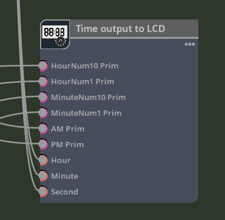
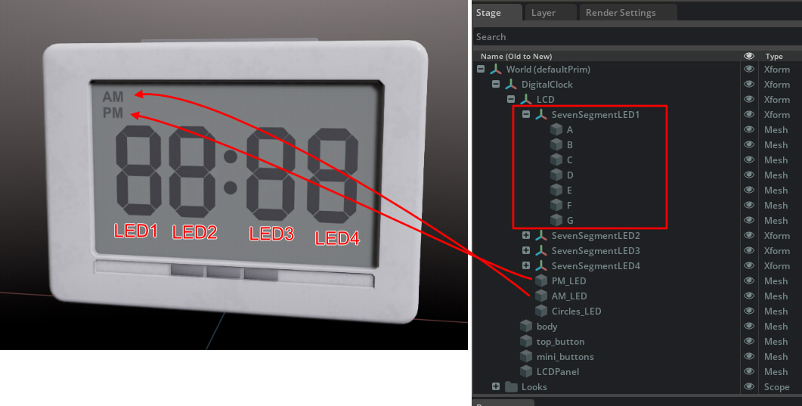
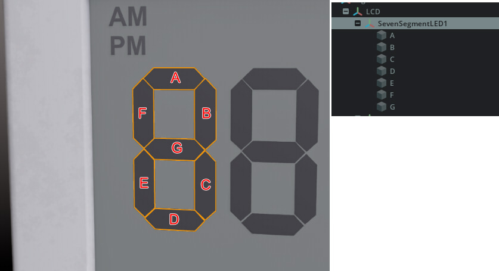

# OutputToLCD

This node controls a virtual 7-segment LED LCD screen.    
     

## OutputToLCD.ogn

```json
{
    "OutputToLCD": {
        "version": 1,
        "categories": "examples",
        "description": "Time output to LCD (hh:mm).",
        "language": "Python",
        "metadata": {
            "uiName": "Time output to LCD (hh:mm)"
        },
        "inputs": {
            "a1_hourNum10Prim": {
                "type": "token",
                "description": "Tenth digit of the hour Prim",
                "metadata": {
                    "uiName": "HourNum10 Prim"
                }
            },
            "a2_hourNum1Prim": {
                "type": "token",
                "description": "First digit of the hour Prim",
                "metadata": {
                    "uiName": "HourNum1 Prim"
                }
            },
            "b1_minuteNum10Prim": {
                "type": "token",
                "description": "Tenth digit of the minute Prim",
                "metadata": {
                    "uiName": "MinuteNum10 Prim"
                }
            },
            "b2_minuteNum1Prim": {
                "type": "token",
                "description": "First digit of the minute Prim",
                "metadata": {
                    "uiName": "MinuteNum1 Prim"
                }
            },
            "c1_amPrim": {
                "type": "token",
                "description": "AM Prim",
                "metadata": {
                    "uiName": "AM Prim"
                }
            },
            "c2_pmPrim": {
                "type": "token",
                "description": "PM Prim",
                "metadata": {
                    "uiName": "PM Prim"
                }
            },
            "d1_hour": {
                "type": "int",
                "description": "Hour",
                "default": 0,
                "metadata": {
                    "uiName": "Hour"
                }
            },
            "d2_minute": {
                "type": "int",
                "description": "Minute",
                "default": 0,
                "metadata": {
                    "uiName": "Minute"
                }
            },
            "d3_second": {
                "type": "int",
                "description": "Second",
                "default": 0,
                "metadata": {
                    "uiName": "Second"
                }
            }
        },
        "outputs": {
        }
    }
}
```

     

### Inputs

|Attribute name|Type|UI name|Description|    
|---|---|---|---|    
|a1_hourNum10Prim|token|HourNum10 Prim|Tenth digit of the hour Prim|    
|a2_hourNum1Prim|token|HourNum1 Prim|First digit of the hour Prim|    
|b1_minuteNum10Prim|token|MinuteNum10 Prim|Tenth digit of the minute Prim|    
|b2_minuteNum1Prim|token|MinuteNum1 Prim|First digit of the minute Prim|    
|c1_amPrim|token|AM Prim|AM Prim|    
|c2_pmPrim|token|PM Prim|PM Prim|    
|d1_hour|int|Hour|Hour|    
|d2_minute|int|Minute|Minute|    
|d3_second|int|Second|Second|    

The "a1_" or "b1_" at the beginning of the attribute name is used to display the data in ascending order when it is displayed in a graph.     

Those that specify a "token" type will be connected to the Prim path.     
In total, 6 Prims will be connected to this node.     
    
Four prims that imitate "7-segment LEDs" are placed as numerical components.     
One of the "7-segment LEDs" consists of four components, A, B, C, D, E, F, and G, as shown below.     
    
The same A, B, C, D, E, F, and G are given for the child Prim names.    
This is turned On/Off to indicate the numerical value.     

The numbers were expressed in 8 bits as follows.      
The lower 7 bits are assigned to ABCDEFG respectively.     

|Image|Bit value|Hexadecimal|     
|---|---|---|     
||01111110|0x7e|     
||00110000|0x30|     
||01101101|0x6d|     
||01111001|0x79|     
||00110011|0x33|     
||01011011|0x5b|     
||01011111|0x5f|     
||01110000|0x70|     
||01111111|0x7f|     
||01111011|0x7b|     

d1_hour, d2_minute, and d3_second are entered as hours, minutes, and seconds.      

## OutputToLCD.py

Controls the display/non-display of the AM and PM panels and the 2-digit 7-segment LED for the hour and minute, respectively.     

```python
from pxr import Usd, UsdGeom, UsdPhysics, UsdShade, Sdf, Gf, Tf
import numpy as np
import omni.ext

class OutputToLCD:
    @staticmethod
    def compute(db) -> bool:
        try:
            hour   = db.inputs.d1_hour
            minute = db.inputs.d2_minute
            second = db.inputs.d3_second

            # xABCDEFG => 0b01111110 = 0x7e = '0'
            nameList = ["A", "B", "C", "D", "E", "F", "G"]
            numMaskList = [0x7e, 0x30, 0x6d, 0x79, 0x33, 0x5b, 0x5f, 0x70, 0x7f, 0x7b]

            # Get stage.
            stage = omni.usd.get_context().get_stage()

            # Show/hide "AM"
            if db.inputs.c1_amPrim != None and db.inputs.c1_amPrim != "":
                prim = stage.GetPrimAtPath(db.inputs.c1_amPrim)
                if prim.IsValid():
                    primImageable = UsdGeom.Imageable(prim)
                    primImageable.GetVisibilityAttr().Set('inherited' if hour < 12 else 'invisible')

            # Show/hide "PM"
            if db.inputs.c2_pmPrim != None and db.inputs.c2_pmPrim != "":
                prim = stage.GetPrimAtPath(db.inputs.c2_pmPrim)
                if prim.IsValid():
                    primImageable = UsdGeom.Imageable(prim)
                    primImageable.GetVisibilityAttr().Set('inherited' if (hour >= 12) else 'invisible')


            # Hour : 10th digit.
            hour12 = hour if (hour < 12) else (hour - 12)
            if db.inputs.a1_hourNum10Prim != None and db.inputs.a1_hourNum10Prim != "":
                basePrimPath = db.inputs.a1_hourNum10Prim
                shiftV = 0x40
                maskV  = numMaskList[(int)(hour12 / 10) % 10]
                for i in range(7):
                    primPath = f"{basePrimPath}/{nameList[i]}"
                    prim = stage.GetPrimAtPath(primPath)
                    if prim.IsValid():
                        primImageable = UsdGeom.Imageable(prim)
                        primImageable.GetVisibilityAttr().Set('inherited' if ((maskV & shiftV) != 0) else 'invisible')
                    shiftV >>= 1

            # Hour : 1th digit.
            if db.inputs.a2_hourNum1Prim != None and db.inputs.a2_hourNum1Prim != "":
                basePrimPath = db.inputs.a2_hourNum1Prim
                shiftV = 0x40
                maskV  = numMaskList[(int)(hour12) % 10]
                for i in range(7):
                    primPath = f"{basePrimPath}/{nameList[i]}"
                    prim = stage.GetPrimAtPath(primPath)
                    if prim.IsValid():
                        primImageable = UsdGeom.Imageable(prim)
                        primImageable.GetVisibilityAttr().Set('inherited' if ((maskV & shiftV) != 0) else 'invisible')
                    shiftV >>= 1

            # Minute : 10th digit.
            if db.inputs.b1_minuteNum10Prim != None and db.inputs.b1_minuteNum10Prim != "":
                basePrimPath = db.inputs.b1_minuteNum10Prim
                shiftV = 0x40
                maskV  = numMaskList[(int)(minute / 10) % 10]
                for i in range(7):
                    primPath = f"{basePrimPath}/{nameList[i]}"
                    prim = stage.GetPrimAtPath(primPath)
                    if prim.IsValid():
                        primImageable = UsdGeom.Imageable(prim)
                        primImageable.GetVisibilityAttr().Set('inherited' if ((maskV & shiftV) != 0) else 'invisible')
                    shiftV >>= 1

            # Minute : 1th digit.
            if db.inputs.b2_minuteNum1Prim != None and db.inputs.b2_minuteNum1Prim != "":
                basePrimPath = db.inputs.b2_minuteNum1Prim
                shiftV = 0x40
                maskV  = numMaskList[(int)(minute) % 10]
                for i in range(7):
                    primPath = f"{basePrimPath}/{nameList[i]}"
                    prim = stage.GetPrimAtPath(primPath)
                    if prim.IsValid():
                        primImageable = UsdGeom.Imageable(prim)
                        primImageable.GetVisibilityAttr().Set('inherited' if ((maskV & shiftV) != 0) else 'invisible')
                    shiftV >>= 1

        except TypeError as error:
            db.log_error(f"Processing failed : {error}")
            return False
    
        return True
```

The following retrieves hours, minutes, and seconds.    

```python
hour   = db.inputs.d1_hour
minute = db.inputs.d2_minute
second = db.inputs.d3_second
```

### AM/PM

The Prim path specified as "token" in the cogn file is received as a string.    
I did the following to show/hide the Prim path in the AM.     
The Prim path is in "db.inputs.c1_amPrim".      
Use "db.inputs.c2_pmPrim" for the PM prim path.     

```python
# Get stage.
stage = omni.usd.get_context().get_stage()

# Show/hide "AM"
if db.inputs.c1_amPrim != None and db.inputs.c1_amPrim != "":
    prim = stage.GetPrimAtPath(db.inputs.c1_amPrim)
    if prim.IsValid():
        primImageable = UsdGeom.Imageable(prim)
        primImageable.GetVisibilityAttr().Set('inherited' if hour < 12 else 'invisible')

# Show/hide "PM"
if db.inputs.c2_pmPrim != None and db.inputs.c2_pmPrim != "":
    prim = stage.GetPrimAtPath(db.inputs.c2_pmPrim)
    if prim.IsValid():
        primImageable = UsdGeom.Imageable(prim)
        primImageable.GetVisibilityAttr().Set('inherited' if (hour >= 12) else 'invisible')
```
"stage.GetPrimAtPath" is used to obtain Prim.     
"prim.IsValid()" is True, the prim exists.    
For AM, the time is before 12, so it will be displayed then.    
In Visibility, specify "inherited" to show or "invisible" to hide.     
PM is the reverse of AM.     

### Display 2-digit numbers

Hour(db.inputs.d1_hour) will be entered as a number from 0-23.     

nameList is an array of letters from 'A' to 'G'.     
The numMaskList contains an array of bits to show/hide for seven of them.    
This will display 0-9.    

```python
nameList = ["A", "B", "C", "D", "E", "F", "G"]
numMaskList = [0x7e, 0x30, 0x6d, 0x79, 0x33, 0x5b, 0x5f, 0x70, 0x7f, 0x7b]
```

Divide the hour into 10 and 1 digits and give a show/hide for each of 'A' through 'G' in the target Prim.     

```python
    # Hour : 10th digit.
    hour12 = hour if (hour < 12) else (hour - 12)
    if db.inputs.a1_hourNum10Prim != None and db.inputs.a1_hourNum10Prim != "":
        basePrimPath = db.inputs.a1_hourNum10Prim
        shiftV = 0x40
        maskV  = numMaskList[(int)(hour12 / 10) % 10]
        for i in range(7):
            primPath = f"{basePrimPath}/{nameList[i]}"
            prim = stage.GetPrimAtPath(primPath)
            if prim.IsValid():
                primImageable = UsdGeom.Imageable(prim)
                primImageable.GetVisibilityAttr().Set('inherited' if ((maskV & shiftV) != 0) else 'invisible')
            shiftV >>= 1

    # Hour : 1th digit.
    if db.inputs.a2_hourNum1Prim != None and db.inputs.a2_hourNum1Prim != "":
        basePrimPath = db.inputs.a2_hourNum1Prim
        shiftV = 0x40
        maskV  = numMaskList[(int)(hour12) % 10]
        for i in range(7):
            primPath = f"{basePrimPath}/{nameList[i]}"
            prim = stage.GetPrimAtPath(primPath)
            if prim.IsValid():
                primImageable = UsdGeom.Imageable(prim)
                primImageable.GetVisibilityAttr().Set('inherited' if ((maskV & shiftV) != 0) else 'invisible')
            shiftV >>= 1
```

The same process is applied to the minute.

## OutputToLCDDatabase.py

For the most part, the process is the same as for "[GetDateTimeDatabase.py](./node_GetDateTime.md)".     

"INTERFACE" enumerates attribute data.     

```python
    PER_NODE_DATA = {}

    INTERFACE = og.Database._get_interface([
        ('inputs:a1_hourNum10Prim', 'token', 0, 'HourNum10 Prim', 'HourNum10 Prim', {}, True, None, False, ''),
        ('inputs:a2_hourNum1Prim', 'token', 0, 'HourNum1 Prim', 'HourNum1 Prim', {}, True, None, False, ''),
        ('inputs:b1_minuteNum10Prim', 'token', 0, 'MinuteNum10 Prim', 'MinuteNum10 Prim', {}, True, None, False, ''),
        ('inputs:b2_minuteNum1Prim', 'token', 0, 'MinuteNum1 Prim', 'MinuteNum1 Prim', {}, True, None, False, ''),
        ('inputs:c1_amPrim', 'token', 0, 'AM Prim', 'AM Prim', {}, True, None, False, ''),
        ('inputs:c2_pmPrim', 'token', 0, 'PM Prim', 'PM Prim', {}, True, None, False, ''),
        ('inputs:d1_hour', 'int', 0, 'Hour', 'Hour', {}, True, 0, False, ''),
        ('inputs:d2_minute', 'int', 0, 'Minute', 'Minute', {}, True, 0, False, ''),
        ('inputs:d3_second', 'int', 0, 'Second', 'Second', {}, True, 0, False, ''),
    ])
```

'inputs:a1_hourNum10Prim', 'inputs:a2_hourNum1Prim', 'inputs:b1_minuteNum10Prim', 'inputs:b2_minuteNum1Prim', 'inputs:c1_amPrim', ' inputs:c2_pmPrim' accepts the Prim path, so the type is token.      

### ValuesForInputs

The inputs designation is described in the "ValuesForInputs" class.     

```python
    class ValuesForInputs(og.DynamicAttributeAccess):
        LOCAL_PROPERTY_NAMES = {"a1_hourNum10Prim", "a2_hourNum1Prim", "b1_minuteNum10Prim", "b2_minuteNum1Prim", "c1_amPrim", "c2_pmPrim", "d1_hour", "d2_minute", "d3_second"}
        """Helper class that creates natural hierarchical access to input attributes"""
        def __init__(self, node: og.Node, attributes, dynamic_attributes: og.DynamicAttributeInterface):
            """Initialize simplified access for the attribute data"""
            context = node.get_graph().get_default_graph_context()
            super().__init__(context, node, attributes, dynamic_attributes)
            self._batchedReadAttributes = [self._attributes.a1_hourNum10Prim, self._attributes.a2_hourNum1Prim, self._attributes.b1_minuteNum10Prim, self._attributes.b2_minuteNum1Prim, self._attributes.c1_amPrim, self._attributes.c2_pmPrim, self._attributes.d1_hour, self._attributes.d2_minute, self._attributes.d3_second]
            self._batchedReadValues = ["", "", "", "", "", "", 0, 0, 0]

        @property
        def a1_hourNum10Prim(self):
            return self._batchedReadValues[0]

        @a1_hourNum10Prim.setter
        def a1_hourNum10Prim(self, value):
            self._batchedReadValues[0] = value

        @property
        def a2_hourNum1Prim(self):
            return self._batchedReadValues[1]

        @a2_hourNum1Prim.setter
        def a2_hourNum1Prim(self, value):
            self._batchedReadValues[1] = value

        @property
        def b1_minuteNum10Prim(self):
            return self._batchedReadValues[2]

        @b1_minuteNum10Prim.setter
        def b1_minuteNum10Prim(self, value):
            self._batchedReadValues[2] = value

        @property
        def b2_minuteNum1Prim(self):
            return self._batchedReadValues[3]

        @b2_minuteNum1Prim.setter
        def b2_minuteNum1Prim(self, value):
            self._batchedReadValues[3] = value

        @property
        def c1_amPrim(self):
            return self._batchedReadValues[4]

        @c1_amPrim.setter
        def c1_amPrim(self, value):
            self._batchedReadValues[4] = value

        @property
        def c2_pmPrim(self):
            return self._batchedReadValues[5]

        @c2_pmPrim.setter
        def c2_pmPrim(self, value):
            self._batchedReadValues[5] = value

        @property
        def d1_hour(self):
            return self._batchedReadValues[6]

        @d1_hour.setter
        def d1_hour(self, value):
            self._batchedReadValues[6] = value

        @property
        def d2_minute(self):
            return self._batchedReadValues[7]

        @d2_minute.setter
        def d2_minute(self, value):
            self._batchedReadValues[7] = value

        @property
        def d3_second(self):
            return self._batchedReadValues[8]

        @d3_second.setter
        def d3_second(self, value):
            self._batchedReadValues[8] = value

        def __getattr__(self, item: str):
            if item in self.LOCAL_PROPERTY_NAMES:
                return object.__getattribute__(self, item)
            else:
                return super().__getattr__(item)

        def __setattr__(self, item: str, new_value):
            if item in self.LOCAL_PROPERTY_NAMES:
                object.__setattr__(self, item, new_value)
            else:
                super().__setattr__(item, new_value)

        def _prefetch(self):
            readAttributes = self._batchedReadAttributes
            newValues = _og._prefetch_input_attributes_data(readAttributes)
            if len(readAttributes) == len(newValues):
                self._batchedReadValues = newValues
```

Specify the attribute names to be used in order in "LOCAL_PROPERTY_NAMES".       

```python
    LOCAL_PROPERTY_NAMES = {"a1_hourNum10Prim", "a2_hourNum1Prim", "b1_minuteNum10Prim", "b2_minuteNum1Prim", "c1_amPrim", "c2_pmPrim", "d1_hour", "d2_minute", "d3_second"}
```

In "\_\_init\_\_", specify "self._attributes.[Attribute name]" as an array.      

```python
self._batchedReadAttributes = [self._attributes.a1_hourNum10Prim, self._attributes.a2_hourNum1Prim, self._attributes.b1_minuteNum10Prim, self._attributes.b2_minuteNum1Prim, self._attributes.c1_amPrim, self._attributes.c2_pmPrim, self._attributes.d1_hour, self._attributes.d2_minute, self._attributes.d3_second]
```

Also, put initial values in self._batchedReadValues.     
```python
self._batchedReadValues = ["", "", "", "", "", "", 0, 0, 0]
```
Specify "" for token. All other values are of type int.     

The property getter/setter is specified as follows.    
If the attribute type is fixed, simply change the attribute name.    

```python
@property
def a1_hourNum10Prim(self):
    return self._batchedReadValues[0]

@a1_hourNum10Prim.setter
def a1_hourNum10Prim(self, value):
    self._batchedReadValues[0] = value
```

The index of "self.\_batchedReadValues" is a number starting from 0 specified in "self.\_batchedReadAttributes[]".      

"\_\_getattr\_\_", "\_\_setattr\_\_", and "\_prefetch" can be copied and pasted as is.      

### ValuesForState(og.DynamicAttributeAccess)

The ValuesForState class "OutputToLCDDatabase" can be used by simply specifying the target class name and copying and pasting.      

```python
class ValuesForState(og.DynamicAttributeAccess):
    """Helper class that creates natural hierarchical access to state attributes"""
    def __init__(self, node: og.Node, attributes, dynamic_attributes: og.DynamicAttributeInterface):
        """Initialize simplified access for the attribute data"""
        context = node.get_graph().get_default_graph_context()
        super().__init__(context, node, attributes, dynamic_attributes)
```

### \_\_init\_\_

In "\_\_init\_\_", inputs, outputs and state classes are created.    

```python
def __init__(self, node):
    super().__init__(node)

    dynamic_attributes = self.dynamic_attribute_data(node, og.AttributePortType.ATTRIBUTE_PORT_TYPE_INPUT)
    self.inputs = OutputToLCDDatabase.ValuesForInputs(node, self.attributes.inputs, dynamic_attributes)

    dynamic_attributes = self.dynamic_attribute_data(node, og.AttributePortType.ATTRIBUTE_PORT_TYPE_STATE)
    self.state = OutputToLCDDatabase.ValuesForState(node, self.attributes.state, dynamic_attributes)
```

There are no outputs in this OutputToLCDDatabase class, so that is not mentioned.    

### class abi

Define the connections for the OmniGraph node.      
Think of ABI as a regular flow.      
Basically, the designation to the ABI interface is a canned statement.      

```python
class abi:
    @staticmethod
    def get_node_type():
        get_node_type_function = getattr(OutputToLCDDatabase.NODE_TYPE_CLASS, 'get_node_type', None)
        if callable(get_node_type_function):
            return get_node_type_function()
        return 'ft_lab.OmniGraph.GetDateTime.OutputToLCD'
```

Since the name of this Extension is "ft_lab.OmniGraph.GetDateTime" and "OutputToLCD" is in it, "ft_lab.OmniGraph.GetDateTime.OutputToLCD" is specified as the return value.      

The compute method is called when this node is executed.     
This also specifies an almost canned statement.     

```python
    @staticmethod
    def compute(context, node):
        try:
            per_node_data = OutputToLCDDatabase.PER_NODE_DATA[node.node_id()]
            db = per_node_data.get('_db')
            if db is None:
                db = OutputToLCDDatabase(node)
                per_node_data['_db'] = db
        except:
            db = OutputToLCDDatabase(node)

        try:
            compute_function = getattr(OutputToLCDDatabase.NODE_TYPE_CLASS, 'compute', None)
            if callable(compute_function) and compute_function.__code__.co_argcount > 1:
                return compute_function(context, node)

            db.inputs._prefetch()
            db.inputs._setting_locked = True
            with og.in_compute():
                return OutputToLCDDatabase.NODE_TYPE_CLASS.compute(db)
        except Exception as error:
            stack_trace = "".join(traceback.format_tb(sys.exc_info()[2].tb_next))
            db.log_error(f'Assertion raised in compute - {error}\n{stack_trace}', add_context=False)
        finally:
            db.inputs._setting_locked = False
            #db.outputs._commit()
        return False
```

The compute method of OutputToLCD.py is called from "OutputToLCDDatabase.NODE_TYPE_CLASS.compute(db)".     

initialize, release, and update_node_version are listed as they are, just matching the class names.     
This is also a canned statement.      

```python
    @staticmethod
    def initialize(context, node):
        OutputToLCDDatabase._initialize_per_node_data(node)
        initialize_function = getattr(OutputToLCDDatabase.NODE_TYPE_CLASS, 'initialize', None)
        if callable(initialize_function):
            initialize_function(context, node)
    @staticmethod
    def release(node):
        release_function = getattr(OutputToLCDDatabase.NODE_TYPE_CLASS, 'release', None)
        if callable(release_function):
            release_function(node)
        OutputToLCDDatabase._release_per_node_data(node)
    @staticmethod
    def update_node_version(context, node, old_version, new_version):
        update_node_version_function = getattr(OutputToLCDDatabase.NODE_TYPE_CLASS, 'update_node_version', None)
        if callable(update_node_version_function):
            return update_node_version_function(context, node, old_version, new_version)
        return False
```

The initialize_type method specifies information about the OmniGraph node.      

```python
    @staticmethod
    def initialize_type(node_type):
        initialize_type_function = getattr(OutputToLCDDatabase.NODE_TYPE_CLASS, 'initialize_type', None)
        needs_initializing = True
        if callable(initialize_type_function):
            needs_initializing = initialize_type_function(node_type)
        if needs_initializing:
            node_type.set_metadata(ogn.MetadataKeys.EXTENSION, "ft_lab.OmniGraph.GetDateTime")
            node_type.set_metadata(ogn.MetadataKeys.UI_NAME, "Time output to LCD")
            node_type.set_metadata(ogn.MetadataKeys.CATEGORIES, "examples")
            node_type.set_metadata(ogn.MetadataKeys.DESCRIPTION, "Time output to LCD")
            node_type.set_metadata(ogn.MetadataKeys.LANGUAGE, "Python")

            # Set Icon(svg).
            icon_path = carb.tokens.get_tokens_interface().resolve("${ft_lab.OmniGraph.GetDateTime}")
            icon_path = icon_path + '/' + "data/icons/outputToLCD.svg"
            node_type.set_metadata(ogn.MetadataKeys.ICON_PATH, icon_path)

            OutputToLCDDatabase.INTERFACE.add_to_node_type(node_type)
```

The information is set as metadata by using "node_type.set_metadata".     

|Key name|Description|Value|     
|---|---|---|     
|ogn.MetadataKeys.EXTENSION|Extension name|ft_lab.OmniGraph.GetDateTime|     
|ogn.MetadataKeys.UI_NAME|UI name of node|Time output to LCD|     
|ogn.MetadataKeys.CATEGORIES|Categories name|examples|     
|ogn.MetadataKeys.DESCRIPTION|Node description|Time output to LCD|     
|ogn.MetadataKeys.LANGUAGE|language used|Python|     
|ogn.MetadataKeys.ICON_PATH|Icon path|[Extension Path]/data/icons/ft_lab.OmniGraph.GetDateTime.outputToLCD.svg|     

See below for available category names.     

https://docs.omniverse.nvidia.com/kit/docs/omni.graph.docs/latest/howto/Categories.html      


The icon path is obtained from the Extension path as follows, and then "/data/icons/outputToLCD.svg" is connected.       

```python
icon_path = carb.tokens.get_tokens_interface().resolve("${ft_lab.OmniGraph.GetDateTime}")
icon_path = icon_path + '/' + "data/icons/ft_lab.OmniGraph.GetDateTime.outputToLCD.svg"
node_type.set_metadata(ogn.MetadataKeys.ICON_PATH, icon_path)
```

Finally, register the "node_type" to which the metadata is assigned.     
```python
OutputToLCDDatabase.INTERFACE.add_to_node_type(node_type)
```

The on_connection_type_resolve method is a canned statement.     

```python
    @staticmethod
    def on_connection_type_resolve(node):
        on_connection_type_resolve_function = getattr(OutputToLCDDatabase.NODE_TYPE_CLASS, 'on_connection_type_resolve', None)
        if callable(on_connection_type_resolve_function):
            on_connection_type_resolve_function(node)
```

### Specify version

After describing the abi class, add the following line as is.     

USD Composer 2023.2.2 (Kit.105.1.2).      
```python
    NODE_TYPE_CLASS = None
    GENERATOR_VERSION = (1, 41, 3)
    TARGET_VERSION = (2, 139, 12)
```
This seemed to need to be updated when the Kit version was upgraded.     
Otherwise, problems occurred, such as icons not being displayed.      

### register method

The register method is a canned statement.     

```python
    @staticmethod
    def register(node_type_class):
        OutputToLCDDatabase.NODE_TYPE_CLASS = node_type_class
        og.register_node_type(OutputToLCDDatabase.abi, 1)
```

### deregister method

The deregister method specifies "[Extension name].[class name of this node]".      

```python
    @staticmethod
    def deregister():
        og.deregister_node_type("ft_lab.OmniGraph.GetDateTime.OutputToLCD")
```
