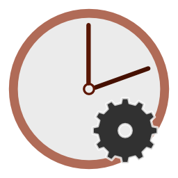
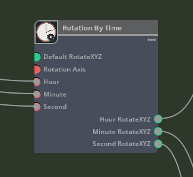
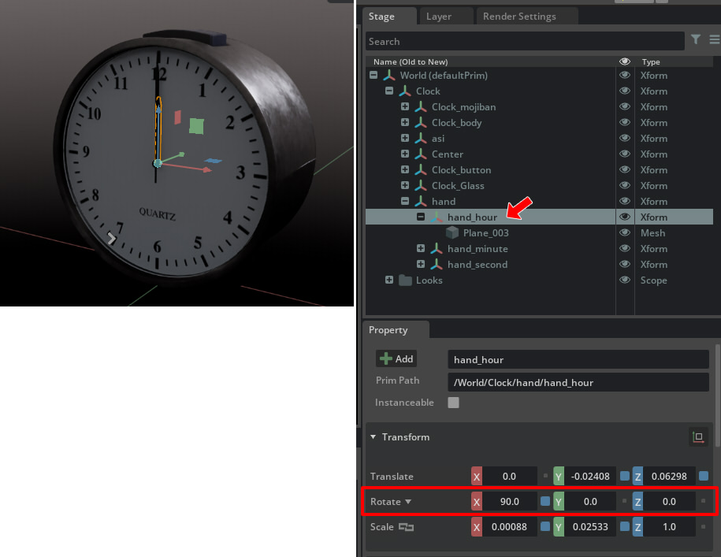

# RotationByTime

Given an hour, minute, and second, returns the XYZ of each rotation(degree).      
     

## RotationByTime.json

```json
{
    "RotationByTime": {
        "version": 1,
        "categories": "examples",
        "description": "Rotation mechanism by time.",
        "language": "Python",
        "metadata": {
            "uiName": "Rotation By Time"
        },
        "inputs": {
            "a1_defaultRotateXYZ": {
                "type": "float[3]",
                "description": "Default rotateXYZ",
                "default": [0.0, 0.0, 0.0],
                "metadata": {
                    "uiName": "Default rotateXYZ"
                }
            },
            "a2_rotationAxis": {
                "type": "int",
                "description": "Rotation axis (0:X, 0:Y, 0:Z)",
                "default": 0,
                "metadata": {
                    "uiName": "Rotation axis"
                }
            },
            "b1_hour": {
                "type": "int",
                "description": "Hour",
                "default": 0,
                "metadata": {
                    "uiName": "Hour"
                }
            },
            "b2_minute": {
                "type": "int",
                "description": "Minute",
                "default": 0,
                "metadata": {
                    "uiName": "Minute"
                }
            },
            "b3_second": {
                "type": "int",
                "description": "Second",
                "default": 0,
                "metadata": {
                    "uiName": "Second"
                }
            }
        },
        "outputs": {
            "a1_hourRotateXYZ": {
                "type": "float[3]",
                "description": "Hour rotateXYZ",
                "default": [0.0, 0.0, 0.0],
                "metadata": {
                    "uiName": "Hour RotateXYZ"
                }
            },
            "a2_minuteRotateXYZ": {
                "type": "float[3]",
                "description": "Minute rotateXYZ",
                "default": [0.0, 0.0, 0.0],
                "metadata": {
                    "uiName": "Minute RotateXYZ"
                }
            },
            "a3_secondRotateXYZ": {
                "type": "float[3]",
                "description": "Second rotateXYZ",
                "default": [0.0, 0.0, 0.0],
                "metadata": {
                    "uiName": "Second RotateXYZ"
                }
            }
        }
    }
}
```
     

### Inputs

|Attribute name|Type|UI name|Description|    
|---|---|---|---|    
|a1_defaultRotateXYZ|float3|Default rotateXYZ|Default rotateXYZ|    
|a2_rotationAxis|int|Rotation axis|Rotation axis (0:X, 1:Y, 2:Z)|    
|b1_hour|int|Hour|Hour|    
|b2_minute|int|Minute|Minute|    
|b3_second|int|Second|Second|    

The "a1_" or "b1_" at the beginning of the attribute name is used to display the data in ascending order when it is displayed in a graph.     

"a1_defaultRotateXYZ" is the initial rotation value of the clock hands provided in the 3D model.     
    
"a2_rotationAxis" is the axis of rotation (0:X, 1:Y, 2:Z).     
In the case of the image above, it rotates around the Y axis. In this case, specify 1.      

b1_hour, b2_minute, and b3_second are entered as hours, minutes, and seconds.      


### Outputs

|Attribute name|Type|UI name|Description|    
|---|---|---|---|    
|a1_hourRotateXYZ|float3|Hour rotateXYZ|Hour rotateXYZ|    
|a2_minuteRotateXYZ|float3|Minute rotateXYZ|Minute rotateXYZ|    
|a3_secondRotateXYZ|float3|Second rotateXYZ|Second rotateXYZ|    

Returns the rotational value of an analog clock corresponding to the input hour, minute, and second.      
The XYZ of the rotation returned here is assigned to the rotation of the clock hands in the 3D model.      

## RotationByTime.py

The rotation of the hands of a clock is calculated.     

```python
import numpy as np
import omni.ext

class RotationByTime:
    @staticmethod
    def compute(db) -> bool:
        try:
            # Calculate clock rotation from seconds.
            if db.inputs.a2_rotationAxis >= 0 and db.inputs.a2_rotationAxis <= 2:
                v = db.outputs.a3_secondRotateXYZ
                v[0] = db.inputs.a1_defaultRotateXYZ[0]
                v[1] = db.inputs.a1_defaultRotateXYZ[1]
                v[2] = db.inputs.a1_defaultRotateXYZ[2]
                v[db.inputs.a2_rotationAxis] = ((float)(db.inputs.b3_second) / 60.0) * 360.0

            # Calculate clock rotation from minutes.
            if db.inputs.a2_rotationAxis >= 0 and db.inputs.a2_rotationAxis <= 2:
                v = db.outputs.a2_minuteRotateXYZ
                v[0] = db.inputs.a1_defaultRotateXYZ[0]
                v[1] = db.inputs.a1_defaultRotateXYZ[1]
                v[2] = db.inputs.a1_defaultRotateXYZ[2]
                v[db.inputs.a2_rotationAxis] = ((float)(db.inputs.b2_minute * 60.0 + db.inputs.b3_second) / (60.0 * 60.0)) * 360.0

            # Calculate clock rotation from hours.
            if db.inputs.a2_rotationAxis >= 0 and db.inputs.a2_rotationAxis <= 2:
                v = db.outputs.a1_hourRotateXYZ
                v[0] = db.inputs.a1_defaultRotateXYZ[0]
                v[1] = db.inputs.a1_defaultRotateXYZ[1]
                v[2] = db.inputs.a1_defaultRotateXYZ[2]
                v[db.inputs.a2_rotationAxis] = ((float)(db.inputs.b1_hour * 60.0 + db.inputs.b2_minute) / (60.0 * 24.0)) * 360.0 * 2.0

        except TypeError as error:
            db.log_error(f"Processing failed : {error}")
            return False
    
        return True
```

## RotationByTimeDatabase.py

For the most part, the process is the same as for "[GetDateTimeDatabase.py](./node_GetDateTime.md)".     

"INTERFACE" enumerates attribute data.     

```python
    PER_NODE_DATA = {}

    INTERFACE = og.Database._get_interface([
        ('inputs:a1_defaultRotateXYZ', 'float[3]', 0, 'Default RotateXYZ', 'Default rotateXYZ', {}, True, None, False, ''),
        ('inputs:a2_rotationAxis', 'int', 0, 'Rotation Axis', 'Rotation axis (0:X, 1:Y, 2:Z)', {}, True, None, False, ''),
        ('inputs:b1_hour', 'int', 0, 'Hour', 'Hour', {ogn.MetadataKeys.DEFAULT: '0'}, True, 0, False, ''),
        ('inputs:b2_minute', 'int', 0, 'Minute', 'Minute', {ogn.MetadataKeys.DEFAULT: '0'}, True, 0, False, ''),
        ('inputs:b3_second', 'int', 0, 'Second', 'Second', {ogn.MetadataKeys.DEFAULT: '0'}, True, 0, False, ''),
        ('outputs:a1_hourRotateXYZ', 'float[3]', 0, 'Hour RotateXYZ', 'Hour RotateXYZ', {}, True, None, False, ''),
        ('outputs:a2_minuteRotateXYZ', 'float[3]', 0, 'Minute RotateXYZ', 'Minute RotateXYZ', {}, True, None, False, ''),
        ('outputs:a3_secondRotateXYZ', 'float[3]', 0, 'Second RotateXYZ', 'Second RotateXYZ', {}, True, None, False, ''),
    ])
```

”RotationByTimeDatabase.py" specifies both inputs and outputs.     
Note that the attribute type specified as "float3" in the ogn file becomes "float[3]".    

### ValuesForInputs

The inputs designation is described in the "ValuesForInputs" class.     

```python
    class ValuesForInputs(og.DynamicAttributeAccess):
        LOCAL_PROPERTY_NAMES = {"a1_defaultRotateXYZ", "a2_rotationAxis", "b1_hour", "b2_minute", "b3_second"}
        """Helper class that creates natural hierarchical access to input attributes"""
        def __init__(self, node: og.Node, attributes, dynamic_attributes: og.DynamicAttributeInterface):
            """Initialize simplified access for the attribute data"""
            context = node.get_graph().get_default_graph_context()
            super().__init__(context, node, attributes, dynamic_attributes)
            self._batchedReadAttributes = [self._attributes.a1_defaultRotateXYZ, self._attributes.a2_rotationAxis, self._attributes.b1_hour, self._attributes.b2_minute, self._attributes.b3_second]
            self._batchedReadValues = [[0.0, 0.0, 0.0], 0, 0, 0, 0]

        @property
        def a1_defaultRotateXYZ(self):
            return self._batchedReadValues[0]

        @a1_defaultRotateXYZ.setter
        def a1_defaultRotateXYZ(self, value):
            self._batchedReadValues[0] = value

        @property
        def a2_rotationAxis(self):
            return self._batchedReadValues[1]

        @a2_rotationAxis.setter
        def a2_rotationAxis(self, value):
            self._batchedReadValues[1] = value

        @property
        def b1_hour(self):
            return self._batchedReadValues[2]

        @b1_hour.setter
        def b1_hour(self, value):
            self._batchedReadValues[2] = value

        @property
        def b2_minute(self):
            return self._batchedReadValues[3]

        @b2_minute.setter
        def b2_minute(self, value):
            self._batchedReadValues[3] = value

        @property
        def b3_second(self):
            return self._batchedReadValues[4]

        @b3_second.setter
        def b3_second(self, value):
            self._batchedReadValues[4] = value

        def __getattr__(self, item: str):
            if item in self.LOCAL_PROPERTY_NAMES:
                return object.__getattribute__(self, item)
            else:
                return super().__getattr__(item)

        def __setattr__(self, item: str, new_value):
            if item in self.LOCAL_PROPERTY_NAMES:
                object.__setattr__(self, item, new_value)
            else:
                super().__setattr__(item, new_value)

        def _prefetch(self):
            readAttributes = self._batchedReadAttributes
            newValues = _og._prefetch_input_attributes_data(readAttributes)
            if len(readAttributes) == len(newValues):
                self._batchedReadValues = newValues
```

Specify the attribute names to be used in order in "LOCAL_PROPERTY_NAMES".       

```python
    LOCAL_PROPERTY_NAMES = {"a1_defaultRotateXYZ", "a2_rotationAxis", "b1_hour", "b2_minute", "b3_second"}
```

In "\_\_init\_\_", specify "self._attributes.[Attribute name]" as an array.      

```python
self._batchedReadAttributes = [self._attributes.a1_defaultRotateXYZ, self._attributes.a2_rotationAxis, self._attributes.b1_hour, self._attributes.b2_minute, self._attributes.b3_second]
```

Also, put initial values in self._batchedReadValues.     
```python
    self._batchedReadValues = [[0.0, 0.0, 0.0], 0, 0, 0, 0]
```
"a1_defaultRotateXYZ" is a float[3] value, all other values are of type int.     


The property getter/setter is specified as follows.    
If the attribute type is fixed, simply change the attribute name.    

```python
    @property
    def a1_defaultRotateXYZ(self):
        return self._batchedReadValues[0]

    @a1_defaultRotateXYZ.setter
    def a1_defaultRotateXYZ(self, value):
        self._batchedReadValues[0] = value
```
The index of "self.\_batchedReadValues" is a number starting from 0 specified in "self.\_batchedReadAttributes[]".      

"\_\_getattr\_\_", "\_\_setattr\_\_", and "\_prefetch" can be copied and pasted as is.      

### ValuesForOutputs

The outputs designation is described in the "ValuesForOutputs" class.    

```python
    class ValuesForOutputs(og.DynamicAttributeAccess):
        LOCAL_PROPERTY_NAMES = { "a1_hourRotateXYZ", "a2_minuiteRotateXYZ", "a3_secondRotateXYZ" }
        """Helper class that creates natural hierarchical access to output attributes"""
        def __init__(self, node: og.Node, attributes, dynamic_attributes: og.DynamicAttributeInterface):
            """Initialize simplified access for the attribute data"""
            context = node.get_graph().get_default_graph_context()
            super().__init__(context, node, attributes, dynamic_attributes)
            self._batchedWriteValues = { }

        @property
        def a1_hourRotateXYZ(self):
            value = self._batchedWriteValues.get(self._attributes.a1_hourRotateXYZ)
            if value:
                return value
            else:
                data_view = og.AttributeValueHelper(self._attributes.a1_hourRotateXYZ)
                return data_view.get()

        @a1_hourRotateXYZ.setter
        def a1_hourRotateXYZ(self, value):
            self._batchedWriteValues[self._attributes.a1_hourRotateXYZ] = value

        @property
        def a2_minuteRotateXYZ(self):
            value = self._batchedWriteValues.get(self._attributes.a2_minuteRotateXYZ)
            if value:
                return value
            else:
                data_view = og.AttributeValueHelper(self._attributes.a2_minuteRotateXYZ)
                return data_view.get()

        @a2_minuteRotateXYZ.setter
        def a2_minuteRotateXYZ(self, value):
            self._batchedWriteValues[self._attributes.a2_minuteRotateXYZ] = value

        @property
        def a3_secondRotateXYZ(self):
            value = self._batchedWriteValues.get(self._attributes.a3_secondRotateXYZ)
            if value:
                return value
            else:
                data_view = og.AttributeValueHelper(self._attributes.a3_secondRotateXYZ)
                return data_view.get()

        @a3_secondRotateXYZ.setter
        def a3_secondRotateXYZ(self, value):
            self._batchedWriteValues[self._attributes.a3_secondRotateXYZ] = value

        def __getattr__(self, item: str):
            if item in self.LOCAL_PROPERTY_NAMES:
                return object.__getattribute__(self, item)
            else:
                return super().__getattr__(item)

        def __setattr__(self, item: str, new_value):
            if item in self.LOCAL_PROPERTY_NAMES:
                object.__setattr__(self, item, new_value)
            else:
                super().__setattr__(item, new_value)

        def _commit(self):
            _og._commit_output_attributes_data(self._batchedWriteValues)
            self._batchedWriteValues = { }
```

Specify the attribute names to be used in order in "LOCAL_PROPERTY_NAMES".       

```python
    LOCAL_PROPERTY_NAMES = { "a1_hourRotateXYZ", "a2_minuiteRotateXYZ", "a3_secondRotateXYZ" }
```

Specify getter/setter for each attribute.      
If the attribute type is fixed, simply change the attribute name.     
```python
    @property
    def a1_hourRotateXYZ(self):
        value = self._batchedWriteValues.get(self._attributes.a1_hourRotateXYZ)
        if value:
            return value
        else:
            data_view = og.AttributeValueHelper(self._attributes.a1_hourRotateXYZ)
            return data_view.get()

    @a1_hourRotateXYZ.setter
    def a1_hourRotateXYZ(self, value):
        self._batchedWriteValues[self._attributes.a1_hourRotateXYZ] = value
```

"\_\_getattr\_\_", "\_\_setattr\_\_", and "\_commit" can be copied and pasted as is.      

### ValuesForState(og.DynamicAttributeAccess)

The ValuesForState class "RotationByTimeDatabase" can be used by simply specifying the target class name and copying and pasting.      

```python
class ValuesForState(og.DynamicAttributeAccess):
    """Helper class that creates natural hierarchical access to state attributes"""
    def __init__(self, node: og.Node, attributes, dynamic_attributes: og.DynamicAttributeInterface):
        """Initialize simplified access for the attribute data"""
        context = node.get_graph().get_default_graph_context()
        super().__init__(context, node, attributes, dynamic_attributes)
```

### \_\_init\_\_

In "\_\_init\_\_", inputs, outputs and state classes are created.    

```python
def __init__(self, node):
    super().__init__(node)

    dynamic_attributes = self.dynamic_attribute_data(node, og.AttributePortType.ATTRIBUTE_PORT_TYPE_INPUT)
    self.inputs = RotationByTimeDatabase.ValuesForInputs(node, self.attributes.inputs, dynamic_attributes)

    dynamic_attributes = self.dynamic_attribute_data(node, og.AttributePortType.ATTRIBUTE_PORT_TYPE_OUTPUT)
    self.outputs = RotationByTimeDatabase.ValuesForOutputs(node, self.attributes.outputs, dynamic_attributes)

    dynamic_attributes = self.dynamic_attribute_data(node, og.AttributePortType.ATTRIBUTE_PORT_TYPE_STATE)
    self.state = RotationByTimeDatabase.ValuesForState(node, self.attributes.state, dynamic_attributes)
```

### class abi

Define the connections for the OmniGraph node.      
Think of ABI as a regular flow.      
Basically, the designation to the ABI interface is a canned statement.      

```python
class abi:
    @staticmethod
    def get_node_type():
        get_node_type_function = getattr(RotationByTimeDatabase.NODE_TYPE_CLASS, 'get_node_type', None)
        if callable(get_node_type_function):
            return get_node_type_function()
        return 'ft_lab.OmniGraph.GetDateTime.RotationByTime'
```

Since the name of this Extension is "ft_lab.OmniGraph.GetDateTime" and "RotationByTime" is in it, "ft_lab.OmniGraph.GetDateTime.RotationByTime" is specified as the return value.      

The compute method is called when this node is executed.     
This also specifies an almost canned statement.     

```python
    @staticmethod
    def compute(context, node):
        try:
            per_node_data = RotationByTimeDatabase.PER_NODE_DATA[node.node_id()]
            db = per_node_data.get('_db')
            if db is None:
                db = RotationByTimeDatabase(node)
                per_node_data['_db'] = db
        except:
            db = RotationByTimeDatabase(node)

        try:
            compute_function = getattr(RotationByTimeDatabase.NODE_TYPE_CLASS, 'compute', None)
            if callable(compute_function) and compute_function.__code__.co_argcount > 1:
                return compute_function(context, node)

            db.inputs._prefetch()
            db.inputs._setting_locked = True
            with og.in_compute():
                return RotationByTimeDatabase.NODE_TYPE_CLASS.compute(db)
        except Exception as error:
            stack_trace = "".join(traceback.format_tb(sys.exc_info()[2].tb_next))
            db.log_error(f'Assertion raised in compute - {error}\n{stack_trace}', add_context=False)
        finally:
            db.inputs._setting_locked = False
            db.outputs._commit()
        return False
```

The compute method of RotationByTime.py is called from "RotationByTimeDatabase.NODE_TYPE_CLASS.compute(db)".     

initialize, release, and update_node_version are listed as they are, just matching the class names.     
This is also a canned statement.      

```python
    @staticmethod
    def initialize(context, node):
        RotationByTimeDatabase._initialize_per_node_data(node)
        initialize_function = getattr(RotationByTimeDatabase.NODE_TYPE_CLASS, 'initialize', None)
        if callable(initialize_function):
            initialize_function(context, node)
    @staticmethod
    def release(node):
        release_function = getattr(RotationByTimeDatabase.NODE_TYPE_CLASS, 'release', None)
        if callable(release_function):
            release_function(node)
        RotationByTimeDatabase._release_per_node_data(node)
    @staticmethod
    def update_node_version(context, node, old_version, new_version):
        update_node_version_function = getattr(RotationByTimeDatabase.NODE_TYPE_CLASS, 'update_node_version', None)
        if callable(update_node_version_function):
            return update_node_version_function(context, node, old_version, new_version)
        return False
```

The initialize_type method specifies information about the OmniGraph node.      

```python
    @staticmethod
    def initialize_type(node_type):
        initialize_type_function = getattr(RotationByTimeDatabase.NODE_TYPE_CLASS, 'initialize_type', None)
        needs_initializing = True
        if callable(initialize_type_function):
            needs_initializing = initialize_type_function(node_type)
        if needs_initializing:
            node_type.set_metadata(ogn.MetadataKeys.EXTENSION, "ft_lab.OmniGraph.GetDateTime")
            node_type.set_metadata(ogn.MetadataKeys.UI_NAME, "Rotation By Time")
            node_type.set_metadata(ogn.MetadataKeys.CATEGORIES, "examples")
            node_type.set_metadata(ogn.MetadataKeys.DESCRIPTION, "Rotation By Time")
            node_type.set_metadata(ogn.MetadataKeys.LANGUAGE, "Python")

            # Set Icon(svg).
            icon_path = carb.tokens.get_tokens_interface().resolve("${ft_lab.OmniGraph.GetDateTime}")
            icon_path = icon_path + '/' + "data/icons/rotationByTimeIcon.svg"
            node_type.set_metadata(ogn.MetadataKeys.ICON_PATH, icon_path)

            RotationByTimeDatabase.INTERFACE.add_to_node_type(node_type)
```

The information is set as metadata by using "node_type.set_metadata".     

|Key name|Description|Value|     
|---|---|---|     
|ogn.MetadataKeys.EXTENSION|Extension name|ft_lab.OmniGraph.GetDateTime|     
|ogn.MetadataKeys.UI_NAME|UI name of node|Rotation By Time|     
|ogn.MetadataKeys.CATEGORIES|Categories name|examples|     
|ogn.MetadataKeys.DESCRIPTION|Node description|Rotation By Time|     
|ogn.MetadataKeys.LANGUAGE|language used|Python|     
|ogn.MetadataKeys.ICON_PATH|Icon path|[Extension Path]/data/icons/ft_lab.OmniGraph.GetDateTime.rotationByTimeIcon.svg|     

See below for available category names.     

https://docs.omniverse.nvidia.com/kit/docs/omni.graph.docs/latest/howto/Categories.html      


The icon path is obtained from the Extension path as follows, and then "/data/icons/rotationByTimeIcon.svg" is connected.       

```python
icon_path = carb.tokens.get_tokens_interface().resolve("${ft_lab.OmniGraph.GetDateTime}")
icon_path = icon_path + '/' + "data/icons/ft_lab.OmniGraph.GetDateTime.rotationByTimeIcon.svg"
node_type.set_metadata(ogn.MetadataKeys.ICON_PATH, icon_path)
```

Finally, register the "node_type" to which the metadata is assigned.     
```python
RotationByTimeDatabase.INTERFACE.add_to_node_type(node_type)
```

The on_connection_type_resolve method is a canned statement.     

```python
    @staticmethod
    def on_connection_type_resolve(node):
        on_connection_type_resolve_function = getattr(RotationByTimeDatabase.NODE_TYPE_CLASS, 'on_connection_type_resolve', None)
        if callable(on_connection_type_resolve_function):
            on_connection_type_resolve_function(node)
```

### Specify version

After describing the abi class, add the following line as is.     

USD Composer 2023.2.2 (Kit.105.1.2).      
```python
    NODE_TYPE_CLASS = None
    GENERATOR_VERSION = (1, 41, 3)
    TARGET_VERSION = (2, 139, 12)
```
This seemed to need to be updated when the Kit version was upgraded.     
Otherwise, problems occurred, such as icons not being displayed.      


### register method

The register method is a canned statement.     

```python
    @staticmethod
    def register(node_type_class):
        RotationByTimeDatabase.NODE_TYPE_CLASS = node_type_class
        og.register_node_type(RotationByTimeDatabase.abi, 1)
```

### deregister method

The deregister method specifies "[Extension name].[class name of this node]".      

```python
    @staticmethod
    def deregister():
        og.deregister_node_type("ft_lab.OmniGraph.GetDateTime.RotationByTime")
```
