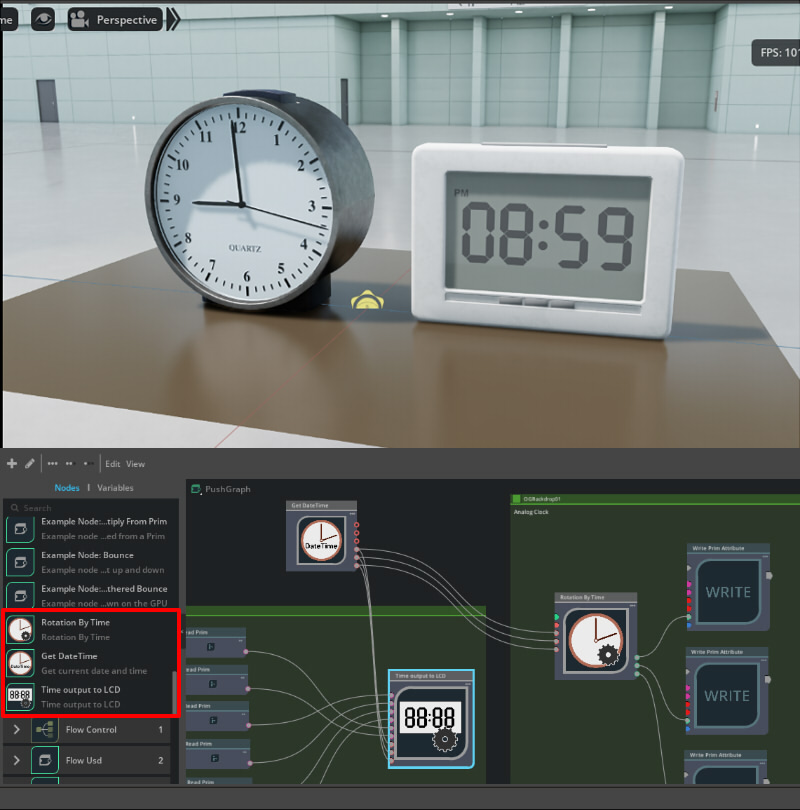
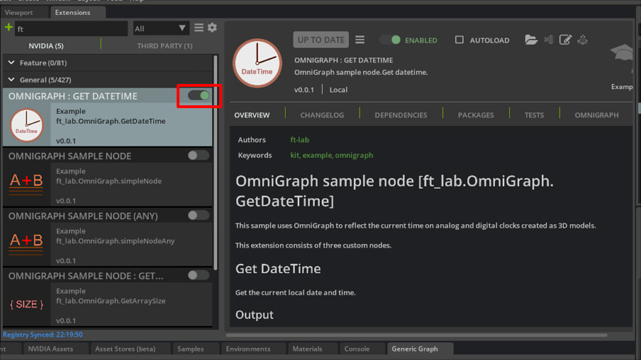
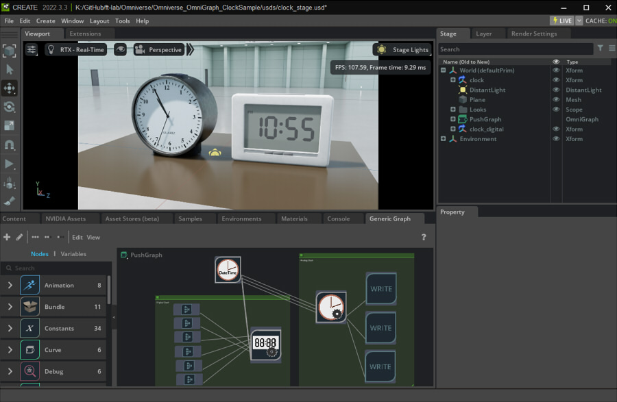

# ft_lab.OmniGraph.GetDateTime

This sample uses OmniGraph to reflect the current time on analog and digital clocks created as 3D models.     
     

This is a sample project in which OmniGraph custom nodes are prepared with a Python Extension to control a pre-prepared 3D model.    

## How to use

I have confirmed that it works with ~~Omniverse Create 2022.3.3~~ USD Composer 2023.1.0-beta.     
Download and use this repository locally.     

```
[extension]
  [ft_lab.OmniGraph.GetDateTime] ... Extension(OmniGraph Nodes) used in this project

[usds]  sample scene
  [Clock]
    [textures]
    clock.usd
  
  [ClockDigital]
    [textures]
    clock_digital.usd

  clock_stage.usd  ... Open and use this locally.
```

* Assign and activate Extension to Omniverse Create.     
Copy "[ft_lab.OmniGraph.GetDateTime](./extension/ft_lab.OmniGraph.GetDateTime/)" to a folder where Omniverse can find it as an Extension.      
     
* Open "[clock_stage.usd](./usds/clock_stage.usd)" in Omniverse Create.     
References two USD "[clock.usd](./usds/Clock/clock.usd)" and "[clock_digital.usd](./usds/ClockDigital/clock_digital.usd)".

You can now see the current time reflected in the analog and digital clocks.      
     


## Documents

* [Description of OmniGraph nodes](./OmniGraphNodes.md)

## Documents for Development

* [Extension Structure](./docs/ExtensionStructure.md)
  * [GetDateTime](./docs/node_GetDateTime.md)
  * [RotationByTime](./docs/node_RotationByTime.md)
  * [OutputToLCD](./docs/node_OutputToLCD.md)
* [3D Models](./docs/Modeling3D.md)

## Change Log

* [Change Log](./ChangeLog.md)

## License

This software is released under the MIT License, see [LICENSE.txt](./LICENSE.txt).
